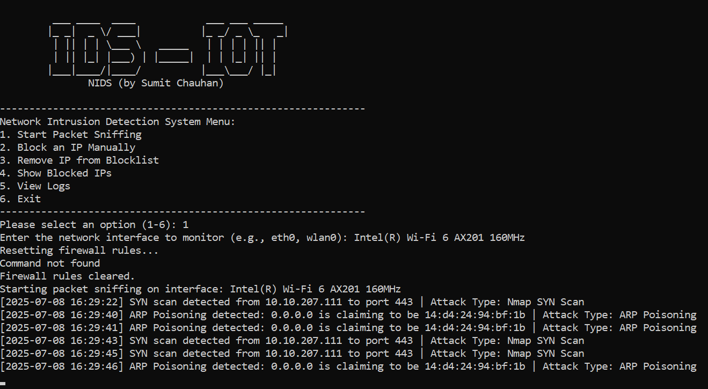

# 🚨 **CyberFlux: Raspberry Pi Network Intrusion Detection System (NIDS)**

CyberFlux is a Python-based Network Intrusion Detection System (NIDS) designed for real-time traffic analysis and threat detection on Raspberry Pi. Lightweight yet powerful, it monitors live network packets over TCP/IP, detects anomalies including brute-force attacks and port scans, and blocks malicious IPs automatically. Tailored for Unix/Linux environments, it's an ideal solution for securing IoT and distributed systems.

### 🖼️ Sample Execution Screenshot

---

## 👨‍💻 **Collaborators**
- **Sumit Chauhan**

---

## ✨ **Key Features**

- 🔐 **Brute Force SSH Detection**  
  Detects repeated failed SSH login attempts and blocks the offending IP.

- 📶 **Real-Time Packet Sniffing**  
  Monitors live network traffic using `scapy` and displays connection attempts with timestamps and attack details.

- 🚫 **Automatic & Manual IP Blocking**  
  Offending IPs are auto-blocked using `iptables`; manual block/unblock options are also available via CLI.

- 🧠 **Nmap Scan Detection**  
  Identifies SYN, NULL, and XMAS scans commonly used by attackers to fingerprint networks.

- ⚠️ **ARP Spoofing Detection**  
  Alerts on ARP poisoning attempts to ensure network integrity.

- 📁 **Attack Logging**  
  All detections are logged with detailed timestamps for post-incident analysis.

- 🧭 **Menu-Driven Interface**  
  Intuitive command-line interface designed for ease of use on headless Linux setups.

---

## 🧰 **Installation**

### 🔧 **Prerequisites**
- Raspberry Pi running a Linux-based OS (e.g., Raspbian)
- Python 3.x
- Required module: `scapy`

### ⚙️ **Setup Instructions**

# Step 1: Clone the Repository
git clone https://github.com/Gosling-dude/yberFlux-Advanced-Network-Intrusion-Detection-System-NIDS-.git  
cd yberFlux-Advanced-Network-Intrusion-Detection-System-NIDS-
# Step 2: Install Python dependencies
sudo apt-get update
sudo apt-get install python3-pip
pip3 install scapy

# Step 3: Install iptables for IP blocking
sudo apt-get install iptables

## 🚀 **Usage**
sudo python3 code.py
## 📋 **Menu Options**
Start Packet Sniffing – Begins monitoring for brute force, scans, and ARP spoofing.

Block an IP Manually – Manually add IPs to the blocklist.

Remove IP from Blocklist – Unblock IPs with a single command.

Show Blocked IPs – View all currently blocked IP addresses.

View Logs – See historical attack records.

Exit – Terminate the tool.

## ⚙️ **Configuration**
🔁 **Failed Login Threshold**
Configure the max failed SSH attempts before triggering an auto-block.

📝 **Logging Path**
Logs are stored in logs.txt in the project root directory.

🧪 **Sample Output**
🔍 Live Traffic Example
[12:00:00] 192.168.1.101 → 192.168.1.24 | Port: 22 | Attack Type: No
[12:00:05] 192.168.1.101 → 192.168.1.24 | Attack: Brute Force - SSH
[12:01:00] Nmap SYN Scan from 192.168.1.102
[12:02:00] ARP Poisoning Attempt by 192.168.1.103 claiming MAC 00:11:22:33:44:55
## 🛑 **Blocked IPs**
192.168.1.101
192.168.1.102
## 📚 **Log Snippets**
[12:00:05] SSH Brute Force - IP: 192.168.1.101
[12:01:00] Nmap SYN Scan Detected - IP: 192.168.1.102
[12:02:00] ARP Poisoning Detected - IP: 192.168.1.103
## 🪪 **License**
This project is licensed under the MIT License. See the LICENSE file for more details.
